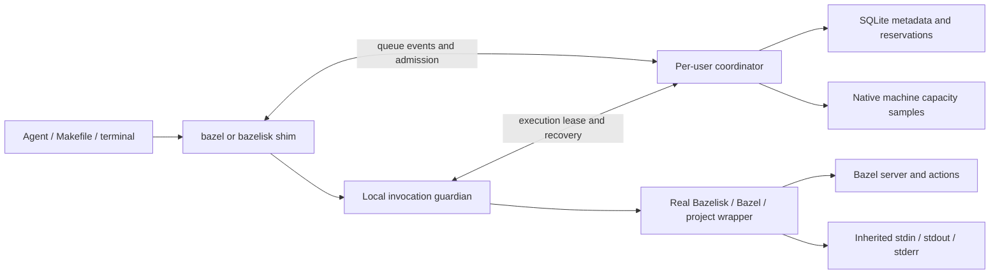
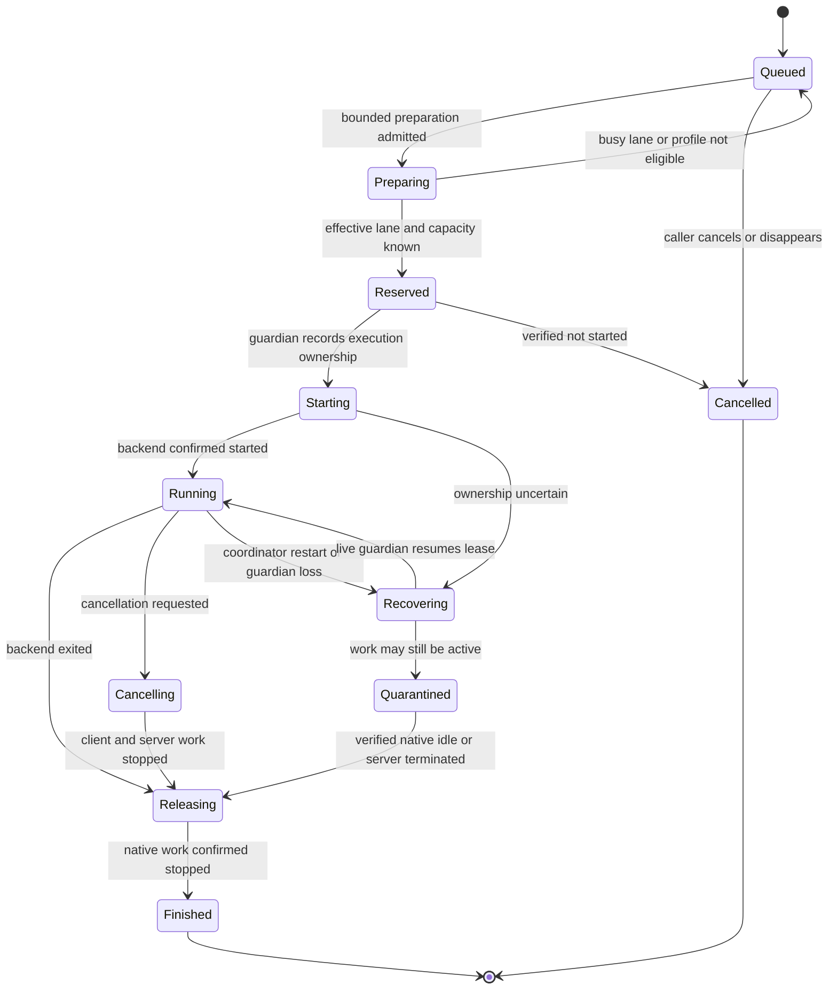

# bazelqueue implementation plan

Prepared: 2026-10-07. Status: implemented; current contracts and validation are documented under docs/.
Local repository: `/Users/davidcollado/Projects/bazelqueue`.
Proposed GitHub repository: `bitomule/bazelqueue`; public, authorized by the user.

## 1. Product contract

Install one native Rust executable. Activate per-user PATH shims named `bazel`
and `bazelisk`. Existing agents, Makefiles, subprocesses, and terminal users keep
their usual commands. Every supported invocation receives a request ID, reports
its queue position and reason for waiting, waits for admission, and returns the
actual command's result. The queue spans that user's repositories and worktrees.

The normal installation must require two commands:

```sh
brew install bitomule/tap/bazelqueue
bazelqueue setup
```

Installation must not require a shell alias, root access, a Rust toolchain,
Pueue, Python, Node, or a separately installed database. Bazel/Bazelisk remains
the actual build engine and version selector.

Initial supported platform: macOS Apple Silicon. The scheduler and protocol are
portable; Linux and Intel macOS are follow-ups until their adapters are tested.
Windows is outside the first release.

Success means safe throughput, not the highest number of simultaneous JVMs.
Parallel actions inside one build and parallel invocations are separate knobs.

## 2. Evidence and constraints

The development Mac has 11 CPU cores and 18 GiB RAM. Approximately 7.7 GiB of
swap was in use during the investigation; this is a snapshot, not a measured
build budget or proof of current memory pressure.

The existing `~/.local/bin/bazelisk` shell shim admits two calls, bypasses its
queue after 1,800 seconds, and expires ownership after 5,400 seconds even when
the holder is alive. The live-holder TTL defect was reproduced with a temporary
fixture. Long-running `bazel run` programs hold its build slots. Some project
rc files allow `worker_max_instances=HOST_CPUS`.

Bazel 8.4.2 is pinned in Alondra and several other projects. Its native server
serializes invocations sharing an output base. Different worktrees normally
have different servers. Shared repository/disk caches do not share admission.
Its action resource limits are estimates, not OS-enforced process quotas.
`shutdown_on_low_sys_mem` is Linux-only in the installed 8.4.2 help.

The existing global cache setup must survive migration: internal/external cache
roots, bounded external-volume rc mirroring, BuildBuddy credentials and cache,
and worktree-specific test scratch. This project does not become a cache cleaner.

`musts` is the distribution reference: Conventional Commits, release-plz,
cargo-dist, GitHub Releases, and `bitomule/homebrew-tap` on branch `master`.
The prohibition on GitHub Actions in Alondra concerns Alondra; the requested
independent bazelqueue repository uses GitHub Actions.

## 3. Architecture decision

Use one Rust binary with four roles, selected by its invocation name or an
explicit internal subcommand:

| Role | Responsibility |
| --- | --- |
| CLI/shim | Parse only bazelqueue controls; retain raw Bazel argv; display queue events; preserve the caller's descriptors and result. |
| Coordinator | Own admission, queue ordering, resource reservations, recovery state, and configuration. |
| Invocation guardian | Own the execution lease and child lifecycle; survive a coordinator restart; cancel safely when its frontend disappears. |
| Native adapters | Backend resolution, Bazel compatibility, macOS resource/process APIs, terminal control, installation, and upgrades. |

The coordinator is not an output proxy and does not reconstruct the caller's
shell environment. The guardian receives execution data locally from the
frontend and starts the backend with inherited file descriptors. The control
socket carries metadata and events, not build stdout/stderr or full environment.



Use a native coordinator rather than combining Pueue with a second resource
controller. The requested foreground semantics, weighted admission, native
server recovery, and zero extra runtime services belong to one ownership model.

## 4. Repository layout and dependency budget

Use one Cargo package with one shipped executable, not a public multi-crate
framework. Separate modules expose narrow contracts:

```text
src/
  main.rs
  cli/            # control CLI, multicall shim, progress presentation
  scheduler/      # pure transitions, fairness, reservations
  protocol/       # framed messages, request identity, negotiation
  coordinator/    # event loop and restart reconciliation
  process/        # guardian, signal and terminal lifecycle
  bazel/          # command classification, backend identity, compatibility
  platform/       # macOS telemetry, process identity, locks, paths
  store/          # metadata journal and migrations
  install/        # reversible setup and removal
tests/
  fixtures/       # a Rust fake backend and controlled fake server
  contract/       # real Bazel versions and temporary repositories
  packaging/      # formula and activation lifecycle
docs/
  architecture.md # implementation-era reference derived from this plan
  installation.md
  troubleshooting.md
packaging/
  homebrew/
.github/workflows/
Cargo.toml
Cargo.lock
rust-toolchain.toml
release-plz.toml
dist-workspace.toml
Makefile
MUSTS.yml
```

Expected direct dependencies: clap, serde/serde_json, toml, Tokio with only
needed features, rusqlite with bundled SQLite, rustix plus a small macOS native
boundary where needed, and thiserror. Prefer std for paths and process data.
Use tracing only if structured diagnostics justify it. Dev-only dependencies
include tempfile and assertion helpers. Pin toolchain/MSRV after checking the
chosen versions; commit Cargo.lock. Do not blindly copy musts' older dist/runners.

No HTTP server, web dashboard, generic task runner, mandatory crates.io
publication, or network request is needed for runtime operation.

## 5. Transparent command handling

When invoked as `bazel` or `bazelisk`, every argument belongs to the backend.
Never parse it with bazelqueue's control CLI parser. For explicit invocation use
`bazelqueue exec -- <backend> <arguments...>` with a clear separator.

Store arguments and environment as OsString/byte data. Do not join argv into a
shell command. Preserve empty arguments, whitespace, quotes, Unicode, non-UTF-8
bytes on Unix, `--flag=value`, `--flag value`, repeated flags, startup options,
target patterns beginning with `-`, response files, and `--` target arguments.
The separator is not a license to reorder arguments.

Bazel chooses its own version, rc files, configs, target resolution, remote
credentials, and build semantics. In compatibility mode its argv is unchanged.
Managed resource mode may change only documented resource-control fields and
the private run handoff; display those decisions explicitly.

Do not reimplement the general Bazel rc/config parser. Unknown versions,
Bazelisk migration/bisect modes, opaque project wrappers, response-file resource
overrides, custom invocation policies, and unprovable configurations use an
exclusive compatibility reservation with untouched arguments. They still queue.
Unknown command classification is expensive/exclusive, not a silent bypass.

## 6. Backend resolution and Bazelisk integration

Resolve and record the real backend before installing interception. Prefer a
stable Homebrew `opt/bazelisk/bin/...` path over a versioned Cellar path. Support
an explicit native Bazel backend and separate configured backends per shim.
Never resolve `bazel` by searching the intercepted PATH at execution time.

Reject loops by executable file identity, not only string paths. Do not treat
the current shell queue script as a safe backend: it would re-enter its queue.
Resolve its documented real Homebrew backend during the explicit migration.

Preserve Bazelisk's `.bazelversion`, USE_BAZEL_VERSION, download settings,
BAZEL_REAL, tools/bazel wrapper discovery, and caller-selected environment.
Do not set BAZELISK_SKIP_WRAPPER globally. Nested invocation tests must exercise
an actual tools/bazel wrapper and Bazelisk's PATH prepending behavior.

The guarantee covers calls through activated PATH shims. Absolute paths to an
unmanaged binary, containers, another OS user, and Bazelisk's internally selected
native executable are not globally intercepted by an alias. Doctor reports this
coverage honestly. Optional supported Bazelisk wrapper integration can extend
coverage, but must compose with existing project wrappers instead of replacing
them. Lease markers are removed before a released run target starts.

Nested managed builds while the parent holds a reservation must never deadlock
by queueing behind their parent. First release detects these and returns an
explicit unsupported-nesting diagnostic unless a tested shared-reservation
contract proves they fit. Never use a general recursion escape as admission
bypass. Calls that bypass PATH remain outside the interception guarantee.

## 7. Queue events and caller experience

For example, stderr in a noninteractive agent session:

```text
bazelqueue: request 42 queued; position 3; waiting for memory capacity
bazelqueue: request 42 queued; position 2; waiting for the workspace
bazelqueue: request 42 starting; profile balanced; 4 CPU, 3072 MiB action estimate
```

Stdout remains exclusively the backend's stdout, so `bazel cquery --output=files`
and command substitutions remain valid. Keep stderr notifications concise:
initial registration, position/reason changes, admission, and infrequent bounded
keepalive notices. Use one updating line on a TTY and plain lines otherwise.
`BAZELQUEUE_PROGRESS=quiet` suppresses progress but not actionable errors.

Position is the rank in the global waiting queue, not an ETA or a promise that
every earlier blocked lane will run first. Status also exposes lane position,
active reservations, eligibility, queue age, and waiting reason. Explicitly show
`reconnecting` or `recovering` during coordinator recovery.

Control commands: setup, doctor, status, status --json, watch, cancel <id>, drain,
resume, config show, daemon run, and uninstall. Prefer a documented JSON event
schema for agent/tool integration; no agent-specific plugin is required.

## 8. Command classes and lanes

| Class | Handling |
| --- | --- |
| help, version, completion | Bounded utility/preparation admission; do not occupy a full build reservation. They may still start a JVM. |
| info, query, cquery, aquery, mod | Bounded analysis reservation and server lane; these are not assumed memory-free. |
| build, test, coverage, run, fetch, sync, vendor | Full resource admission with conservative defaults. |
| clean, shutdown | Exclusive maintenance lane for that output base; not stuck behind unrelated resource admission. |
| Unknown/opaque | Exclusive compatibility admission. |

Use canonical workspace identity as an initial lane. After bounded admission,
ask Bazel itself for effective output_base and server identity with the original
startup context. Merge aliases into the true lane before executing real work.
Limit preparation concurrency and account for a newly started JVM; preflight is
not an unbudgeted probe on every queued call. Remembering a previous result is
only a hint: startup options, version, environment, and cache-root changes can
change the output base. Do not call `bazel info` merely to assign queue position.

Native contention checks use a separate, known nonblocking probe. Do not retry
the user's command because it returned 9: a run target can legitimately return
9. Native lock ownership remains authoritative when an unmanaged client races.

Do not share an output base across independent worktrees to manufacture a global
queue. Keep existing build isolation and shared artifact caches.

## 9. Resource admission and throughput

Maintain CPU tokens and memory reservations in one coordinator. Account for
JVM/analysis overhead, compiler/worker estimates, tests/simulators where owned,
and other active reservations. A running reservation is immutable: starting a
new narrow build does not shrink a wide build already in flight.

Admission requires both a reservation that fits the configured host budget and
an acceptable native memory-pressure sample. Available-memory samples and
existing reservations are different checks; do not double-count them as though
they were interchangeable. External applications and unmanaged builds reduce
observed headroom even though they have no reservation.

Default to one expensive invocation until compatibility tests and observed
profiles support more. Allow an explicitly calibrated two-build profile on this
Mac; do not ship David-specific defaults. Compute generic defaults from detected
hardware with configurable CPU and memory headroom.

Candidate calibration profiles for this Mac, not measured release defaults:

| Profile | CPU/action scheduling | Estimated action RAM | Purpose |
| --- | --- | --- | --- |
| wide | 8 CPU, at most 8 jobs | 6144 MiB | One expensive invocation with high internal parallelism. |
| balanced | 4 CPU, at most 4 jobs | 3072 MiB | Two calibrated smaller invocations if total overhead and headroom fit. |
| compatibility | Exclusive expensive admission | Conservatively reserve the available build budget | Preserve opaque arguments/configuration. |

The action estimate is not the whole invocation's reservation. Add measured
JVM and worker overhead and a margin before admitting two balanced jobs.
Reserve resources before the STARTING transition, not after sampling a process.
Do not open a third build because one currently happens to be idle or cached.

Use oldest-eligible scheduling across lanes, FIFO within a lane, and bounded
backfilling. Once the oldest large eligible request waits for capacity, drain
enough reservations for it instead of admitting an endless stream of small jobs.
One workspace's native lock waiter must not consume an expensive global slot.
Administrative maintenance must have a bounded way to run without starvation.

Memory warning/critical pressure stops new expensive admissions. Resume only
after recovery hysteresis. CPU samples inform profile choice; CPU utilization
alone does not determine memory safety. If telemetry is unavailable, report it
and use a configured conservative/exclusive path or remain waiting; do not
treat missing values as zero usage.

Use native APIs, not `ps`, `sysctl`, memory_pressure, or grep subprocess loops at
runtime. Gather physical capacity, memory pressure, swap activity deltas, and
same-user process footprints where permitted. A nonzero historical swap total
must not permanently block the queue. Record peak observations conservatively;
cache hits must not teach the scheduler that every cold build is cheap.

## 10. Managed Bazel resource policy

The safe initial release always supports compatibility admission. Managed
parallel profiles require a compatibility proof, not a claim that appending
`--jobs` controls all compiler threads or the whole machine.

Use a version-specific adapter for supported Bazel releases, initially 8.4.2
and one pinned current stable release. Prefer Bazel's native invocation policy
for managed command flags after its config expansion. Limit jobs, CPU/memory
action estimates, worker parallel requests, and local test jobs. Startup JVM
heap settings belong in stable opt-in configuration, not changing per request
and restarting the server on every profile switch.

Repeated local_resources values may contain custom resource names. Preserve
those values while capping CPU/memory. Specific worker mnemonics can override a
generic worker default; test them explicitly. Honor provably stricter caller
limits. If the adapter cannot preserve/compose a policy or determine its scope,
use exclusive compatibility mode with unchanged argv.

Canonicalize-flags is useful for flag conversion, but is not a general way to
recover the effective build configuration from every rc and named config. Its
8.4.2 implementation parses the supplied residue separately. Do not assume it
expands the original invocation's whole rc/config context.

Policy enforcement, strict user overrides, repeatable flags, worker multiplex
limits, Starlark flags, and supported wrappers are milestone-zero release gates.
Until a profile is proven, it cannot be used for concurrent admission.
Do not automatically enable experimental CPU-load scheduling or worker-killing
memory flags. The latter can fail legitimate local builds.

No macOS hard memory-quota claim: admission and estimates reduce oversubscription
but one unexpectedly large compiler/test can still exceed its prediction.
React by stopping new admissions and increasing its future reservation, not by
silently killing or retrying it. Hard per-process memory isolation would be a
separate product requirement and platform design.

## 11. Invocation and lease state machine



Persist a reservation before issuing its grant. Commit STARTING before spawn.
The guardian holds a kernel-managed execution witness for its lifetime and
reports the actual process identity. Use a boot identity plus PID birth/start
time; PID alone is not ownership. Never unlink/recreate a live lock inode to
reset ownership. SQLite transactions and lock ownership must reconcile safely
if death happens between any two steps.

A grant deadline may retract only a reservation proven never to have started.
There is no build TTL. Heartbeats can identify lost connections, not prove that
the compiler has stopped or justify reclaiming a running reservation.

## 12. Signals, terminal behavior, and crash recovery

The guardian retains original file descriptors. TTY execution must support
foreground process-group handoff, window changes, Ctrl-C, and restored terminal
ownership. Non-TTY execution must preserve pipe backpressure and stdin. Do not
introduce a PTY by default; it changes isatty and output semantics. Never send a
signal to the caller's shell process group or double-forward terminal SIGINT.
Ctrl-Z/fg behavior is an explicit contract test before claiming transparency.

Cancel while queued: withdraw the request immediately, launch nothing, and
return interrupt semantics. Cancel while running: request native cancellation,
forward signals to owned processes as appropriate, await shutdown evidence,
and only then release capacity. Preserve backend exit codes and signal behavior;
bazelqueue's own failures use documented diagnostics without mislabeling them
as Bazel failures.

The frontend and guardian have a private liveness channel. Frontend SIGKILL or
agent termination triggers guardian cancellation; it does not automatically
free the lease. A native Bazel server can survive its client and continue work.
After guardian loss, hold or quarantine its reservation until a version-specific
nonblocking native-server probe proves idle or the identified server is dead.
Never infer server quiescence solely from the wrapper PID being dead or a BEP
BuildFinished event.

A coordinator crash must not terminate an otherwise owned build. Guardians
keep their leases and reconnect to a restarted coordinator with authenticated
identity. The new coordinator reconciles the durable ledger before new
admission. Queued frontends reconnect with the same request ID and sequence;
dead callers are withdrawn. Never replay a command whose caller disappeared.

If a coordinator cannot restart or state is corrupt, callers receive a clear
infrastructure error or continue reconnecting under the documented policy.
They never bypass admission. Recovery/status/cancel remain available for
quarantines. Reset cannot mean deleting reservations while builds are alive.

## 13. bazel run handoff

For supported ordinary run invocations, use Bazel's private script generation
to compile and produce the execution environment, release the build reservation
after the compilation transaction ends, and execute the generated script with
the caller's original descriptors. Never reconstruct runfiles/environment by
guessing a binary path or using a separate cquery build.

The generated script is Bazel's contract, not handwritten queueing logic. Put it
in a private temporary directory, restrict permissions, and never persist its
possibly sensitive target arguments in the queue history.

Respect an explicit --script_path: write the caller's requested artifact and
do not execute it. Respect --norun and --run_under. Test target args after `--`,
run environment changes, runfiles, executable exit 9/130, interactive stdin,
and run targets that are tests. Opaque wrappers/versions or unproven modes
retain conservative native behavior with a visible compatibility reason.

An executing target can remain resource-intensive. Release the build/server
lane but track its run-phase process footprint separately. Do not treat a model
evaluation, load test, or VM as free merely because compilation finished. A
long-lived lightweight daemon should not block unrelated builds indefinitely.

Reuse of the same output base can mutate runfiles while a released target runs.
Define and test supported runfiles pinning/overlap semantics; keep a narrower
artifact/lane guard or report a compatibility limitation where safety cannot be
proven. Independent worktree builds should continue when capacity allows.

## 14. Coordinator startup, protocol, and persistent data

Start lazily on the first managed call. One per-user coordinator owns a native
exclusive lock. Concurrent starters connect to the winner; they cannot launch
independent queues. Startup failure never means run unqueued. `brew services`
support is optional convenience, using the same singleton contract.

Use a local Unix-domain socket in a private short path within a UID-owned
directory; respect Unix socket path length limits. Verify directory ownership,
socket peer UID, restrictive permissions, and a matching installation/instance
token. Reject symlink substitution in owned state paths. No TCP listener.

Use bounded length-prefixed control messages, protocol version negotiation,
request IDs, event sequence numbers, reconnect cursors, and frame-size limits.
Execution argv does not need to travel to the coordinator. If bytes ever cross
IPC, encode them losslessly rather than assuming valid UTF-8. Slow status
subscribers must not block the scheduler or lose the final invocation outcome.

SQLite stores request metadata, arrival sequence, lane identity, reservation,
process birth identity, lifecycle events, and schema version. Bound completed
history. Do not store full argv, environment, credentials, generated run scripts,
or all build output. Execution data stays with the local frontend/guardian.
Persist durable transitions; use an injectable storage trait for tests.

Configuration lives in a standard per-user application config directory, with
an explicit test override. Runtime state and database live in standard user
state/cache directories with a short socket path. Do not place private runtime
state in a workspace or commit it. Never use a shared temporary path with
permissive permissions as the global queue.

## 15. CLI configuration and observability

Configuration covers backend paths, CPU/memory headroom, allowed profiles,
maximum expensive concurrency, preparation/analysis budgets, telemetry
hysteresis, progress mode, and history retention. Separate global installation
policy from optional per-project profile hints. Hints cannot override global
capacity or turn failures into admission bypass.

Reload scheduler settings atomically. Lowering limits drains existing work;
it does not revoke reservations or kill builds. Raising limits admits additional
work only after recovery and telemetry checks. Explain rejected configuration.

Doctor checks real executable resolution, shim ownership and PATH precedence,
backend compatibility, existing project wrappers, socket ownership, singleton
state, stale reservations, telemetry availability, cache-root behavior, and
readiness for a selected profile. It shows exact remediation steps.

Status/watch expose request ID, queue rank, lane rank, cwd display, command name,
age, lifecycle, reserved resources, active run-phase footprint, and reason:
workspace busy, capacity, memory pressure, preparation budget, recovery,
quarantine, or draining. Display metadata is sanitized and never a reconstructed
shell command. Progress/ETA is not inferred from elapsed time alone.

## 16. Homebrew installation and activation

The formula installs `bin/bazelqueue` and private shim symlinks under
`libexec/shims/bazel` and `libexec/shims/bazelisk`. It must not put either name
in Homebrew's shared bin directory: that conflicts with the bazelisk formula.
Use an opt-stable path for user links so an upgrade does not break them.

`bazelqueue setup` resolves backends, validates state, generates an ownership
manifest, then activates user PATH links atomically. Default activation location
is `~/.local/bin` when already in PATH; allow an explicit --bin-dir. Where needed,
provide a clearly delimited removable PATH block for supported shells; do not
assume interactive aliases affect Makefiles or agents. Already running processes
retain their environment; doctor must explain when a restart is needed.

Existing foreign files are not silently overwritten. Setup shows a concrete
migration preview with backend resolution and immutable backup, then accepts
an explicit replacement mode. On this Mac the old bazel/bazelisk script must
be backed up once, not used as the new backend. Re-running setup is idempotent.

Setup does not silently rewrite the user's .bazelrc. Any stable resource-profile
include is a separate managed, reversible block with an ownership checksum.
Cache-maintenance and bounded external-rc synchronization are accounted for in
the migration decision; do not assume the old wrapper performed only queueing.

Uninstall removes only links/blocks it still owns and restores backups only if
the destination has not changed. Preserve edited user configuration. Stop/drain
the coordinator deliberately; removing the Homebrew binary alone cannot repair
user links. Document `bazelqueue uninstall` before `brew uninstall bazelqueue`.
No automatic background deletion of a user's pre-existing files.

## 17. Upgrade and rollback

Use an opt-stable invocation path and version-aware protocol handshake. A new
binary may connect to a compatible old coordinator. For an incompatible upgrade,
drain pending execution ownership and restart safely; clients wait and reconnect.
Do not run independent old/new coordinators against the same reservation ledger.
Old guardians need a documented compatibility window or must finish before the
new coordinator admits work.

Database migrations run under the singleton lock with a recoverable backup.
Never migrate beneath an old active coordinator. Downgrades either read a
compatible schema or provide an explicit safe rollback path; no forced reset.
Restore the old PATH integration only after the new coordinator is drained.

## 18. GitHub Actions and releases

Use Conventional Commit PR titles and release-plz for a rolling version/changelog
PR. cargo-dist builds the single executable and owns the GitHub release assets.
Do not have two tools create the same GitHub release. Crates.io publication is
optional and not required for Homebrew distribution.

Initial artifact: `aarch64-apple-darwin`, built and tested on a current supported
GitHub-hosted macOS ARM runner. Pin the Rust and dist versions. Select current
runner labels while implementing; old musts runner workarounds are not a template.
Build the shipped archive from a tag/commit with --locked, test that artifact,
generate SHA-256 checksums, and publish immutable release bytes. Never move tags.

The Homebrew formula uses prebuilt archives, depends on bazelisk for the default
backend, and creates private libexec shims only. cargo-dist can produce archives
and metadata, but its default top-level bin aliases are inappropriate here. Use
a checked-in tested formula template or supported custom publish step for the
private shims rather than patching generated output by hand.

Publish `Formula/bazelqueue.rb` to `bitomule/homebrew-tap` branch `master` only
after the release artifacts and checksums exist and formula installation tests
pass. Serialize publication safely with the tap's other release writers; rebase
the isolated formula change on the current master instead of force-pushing.
Publishing a prerelease must not replace the stable formula. Retrying a failed
tap update reuses the existing release assets; it does not rebuild them.

CI jobs: fmt, clippy, unit/integration tests, real Bazel contract tests on macOS,
MSRV, locked release build, packaging/activation tests, and musts evidence.
Tests use temporary HOME/config/state and small hermetic fixtures. Heavy local
Rust/Swift throughput experiments are opt-in, never ordinary CI.

Pin third-party Actions to reviewed commit SHAs. PR validation has read-only
permissions and no publish secrets. Release/tap jobs receive only their required
write permissions. A GitHub App or scoped release token is needed where tags/PRs
must trigger subsequent workflows; default GITHUB_TOKEN behavior must be tested.
Use separate scoped tap credentials. No Apple signing-key export: if signing or
notarization is desired later, specify that pipeline separately and do not claim
the first artifacts are notarized. Do not automatically enable paid runner tiers.

## 19. Test strategy and acceptance matrix

The scheduler uses virtual time, fake samples, and controlled events. Process
tests use a Rust fixture backend/server with barriers and pipes. No assertion
that a job finishes within an arbitrary wall-clock interval. Watchdog timeouts
can fail a stuck test, never prove correct scheduling. No sleeps or retry loops
masking races.

| Area | Required tests |
| --- | --- |
| argv | Exact byte/order preservation; empty/non-UTF-8 args; startup flags; configs; repeats; response files; `--`; negative target patterns. |
| Backend | Both names; real Bazelisk version selection; tools/bazel; stable Homebrew paths; recursion; missing backend; opaque wrapper fallback. |
| Queue | FIFO lanes; correct rank changes; bounded backfill; large-request fairness; maintenance fairness; no lost wakeup; no admission without reservation. |
| Capacity | Parallel admitted totals; immutable live grants; pressure pause/recovery; missing telemetry; historical swap; CPU/memory dimensions; overhead. |
| Native lanes | Shared workspace; different worktrees; explicit shared output_base; changed rc/root; batch; unmanaged lock holder. |
| Policies | CLI/rc/config precedence; stricter user limits; specific worker mnemonics; multiplex; named extra resources; existing invocation policy; unknown versions. |
| IO/terminal | stdout byte identity; stderr progress; large pipes; stdin; isatty; Ctrl-C; TERM; Ctrl-Z/fg; window/foreground restoration. |
| Cancellation | Queued withdrawal; active cancellation; frontend SIGKILL; guardian loss; server survives client; no early lease release. |
| Recovery | Death at each durable transition; coordinator restart; PID reuse; stale socket; two starters; state corruption; quarantines; reconnect sequence. |
| run | Runfiles/env/args; explicit script_path; norun; run_under; interactive target; target exit 9/130; heavy run accounting; overlap with later builds. |
| Install | Clean setup; existing script backup; idempotence; path spaces; edited config; interrupted activation; uninstall; upgrade/downgrade. |
| Packaging | Shipped binary on supported OS; checksums; formula style/install; private shims; no bazelisk conflict; no Rust/runtime DB dependency. |

Real Bazel contract tests must demonstrate that a build's actions have actually
stopped before another reservation is released after client death. A fake child
test alone cannot validate native server cancellation.

## 20. Implementation milestones

### M0: compatibility and recovery proof

Build temporary real-Bazel fixtures covering original startup/config arguments,
effective output base, native busy/idle probes, invocation-policy composition,
client/guardian/server death, foreground TTY control, and script_path run handoff.
Pin tested Bazel releases and Bazelisk. Produce an explicit support table and
record decisions for every opaque fallback. Exit gate: no unresolved ownership
or argument-preservation assumption in a profile advertised as concurrent.

### M1: executable skeleton and pure scheduler

Create Cargo package, locked dependencies, CLI and protocol types, injected
clock/telemetry/store interfaces, deterministic queue and state machine, fixture
backend, Makefile, and MUSTS.yml. No machine activation. Exit gate: scheduler
invariants and argument roundtrip pass; musts has recorded real evidence.

### M2: coordinator, leases, and foreground execution

Implement singleton/socket ownership, SQLite transitions, guardian witnesses,
byte-preserving spawn, stdout/stderr/TTY behavior, cancellations, restart
reconciliation, and quarantines. Ship only exclusive compatibility scheduling
until recovery tests pass. Exit gate: all process-loss tests and real native
server release tests pass; no TTL or fail-open path exists.

### M3: native telemetry and supported parallel profiles

Implement macOS capacity adapter, overhead accounting, immutable budgets,
pressure hysteresis, bounded preparation and lanes, native policy adapter, run
handoff/footprint tracking, status/watch/doctor. Exit gate: tests prove resources
and native locks cannot multiply unnoticed; opaque modes remain queued.

### M4: reversible installation and migration

Implement backend detection, private Homebrew shims, setup preview/manifest,
atomic activation, rollback/uninstall, cache-infrastructure preservation, and
upgrade draining. Test complete lifecycle in isolated HOME fixtures. Exit gate:
existing bazelisk installation and foreign user files remain intact.

### M5: public distribution pipeline

Create GitHub repo with confirmed visibility, CI, release-plz, dist configuration,
formula template/custom publishing, release smoke tests, and required secrets
documented by name only. First prerelease builds and installs in isolated paths.
Exit gate: real release archive and formula work; stable tap is untouched until
stable publication is explicitly requested.

### M6: this Mac's migration and calibration

Record baseline backend/shim/rc/queue state. Drain existing queue users without
interrupting their builds. Activate the tested replacement; retire the old
admission logic while preserving cache behaviors. Run one heavy experiment at
a time; compare sequential wide versus two balanced Rust/Swift/test workloads.
Measure total makespan, per-call latency, queue fairness, native memory pressure,
peak footprints, swap activity deltas, and terminal responsiveness. Do not run
`bazel clean` on the user's existing caches to manufacture a cold measurement.

Increase concurrency only if throughput improves within the memory/latency
budget. Save a local calibrated configuration and demonstrate multiple agents
receiving queue positions, waiting, completing, and cancelling. Exercise rollback.
Exit gate: transparent make/bazel/bazelisk flows, no extra runtime dependencies,
and the old shim no longer controls admission.

## 21. Initial implementation order

1. Resolve M0's native contracts with small fixtures.
2. Implement exact foreground compatibility with one expensive reservation.
3. Prove restart/cancellation recovery before adding parallel admission.
4. Add tested native profiles and telemetry.
5. Add setup/uninstall and package lifecycle.
6. Add release automation and publish a prerelease.
7. Migrate/calibrate this Mac and then publish a stable release.

The critical path is ownership correctness, not queue presentation or packaging.
Do not ship an adaptive concurrency claim while its guardian/server recovery
contract is unresolved.

## 22. Explicitly deferred scope

Linux/Intel/Windows adapters; distributed/remote executors; cross-user quotas;
automatic build coalescing; target-level global scheduling; hard OS memory
quotas; VM/simulator pool ownership; generic command scheduling; web UI; signing
and notarization; publishing a reusable protocol crate; and automatic mutation
of every project's AGENTS.md or tools/bazel wrapper.

## 23. Resolved delivery scope

The user authorized the complete implementation, E2E validation, public
bitomule/bazelqueue repository, and live migration of the existing shim. Initial
published platform is macOS Apple Silicon. Release-plz and Homebrew credentials
will be added manually by the user; all validation, package generation, local
installation and publication configuration are prepared independently of them.

Current implemented contracts and precise limits are documented under docs/.
Future incompatible wire protocols fail closed; automatic cross-protocol drain
is deferred until an actual second protocol exists and is tested. Initial
calibration is machine-specific and does not claim a universal maximum.

## 24. References

- [Bazel client/server model](https://bazel.build/run/client-server)
- [Bazel 8.4.2 resource scheduler](https://github.com/bazelbuild/bazel/blob/8.4.2/src/main/java/com/google/devtools/build/lib/actions/ResourceManager.java)
- [Bazel 8.4.2 invocation policy](https://github.com/bazelbuild/bazel/blob/8.4.2/src/main/protobuf/invocation_policy.proto)
- [Bazel 8.4.2 canonicalization](https://github.com/bazelbuild/bazel/blob/8.4.2/src/main/java/com/google/devtools/build/lib/runtime/commands/CanonicalizeCommand.java)
- [Bazel 8.4.2 run contract](https://github.com/bazelbuild/bazel/blob/8.4.2/src/main/java/com/google/devtools/build/lib/runtime/commands/RunCommand.java)
- [Bazel memory controls](https://bazel.build/advanced/performance/memory)
- [Bazel persistent workers](https://bazel.build/remote/persistent)
- [Bazelisk wrapper contract](https://github.com/bazelbuild/bazelisk/blob/master/README.md)
- [cargo-dist Homebrew installers](https://axodotdev.github.io/cargo-dist/book/installers/homebrew.html)
- [Homebrew formula cookbook](https://docs.brew.sh/Formula-Cookbook)
- [release-plz setup](https://release-plz.dev/docs/github/quickstart)
- [GitHub Actions secure use](https://docs.github.com/en/actions/reference/security/secure-use)
- Local distribution reference: `/Users/davidcollado/Projects/musts/Cargo.toml`,
  `release-plz.toml`, and `.github/workflows/`.
