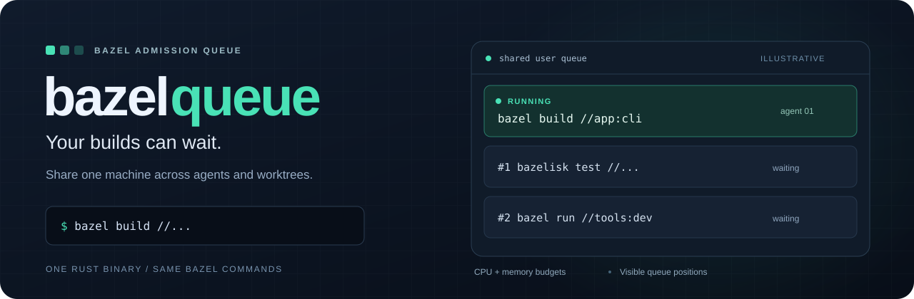
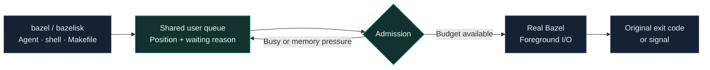

<p align="center">
  
</p>

<p align="center">
  <a href="https://github.com/bitomule/bazelqueue/actions/workflows/ci.yml"></a>
  <a href="https://github.com/bitomule/bazelqueue/releases"></a>
  <a href="https://github.com/bitomule/homebrew-tap/blob/master/Formula/bazelqueue.rb"></a>
  
</p>

# bazelqueue

**Keep calling `bazel`. Let the queue decide when it can start.**

Agents, terminals and Makefiles share one queue per user. When CPU or memory
capacity is occupied, the caller sees its position and waits. Once admitted,
the real Bazel command runs with its arguments, terminal, stdin and stdout.
Its exit code or signal goes back to the caller.

One Rust executable, approximately **5 MiB**, with SQLite linked in. End users
need Bazel/Bazelisk; Rust and Python are development dependencies.

[Install](#install) · [Queue controls](#queue-controls) · [Configure](#configure) · [Compatibility](#compatibility) · [Documentation](#documentation)

## Install

```sh
brew install bitomule/tap/bazelqueue
bazelqueue setup
```

Open a new terminal and check that both names resolve to `~/.local/bin`:

```sh
command -v bazel bazelisk
```

Then use the commands already in your workflow:

```sh
bazel build //...
bazelisk test //... --test_output=errors
bazel run //tools:dev -- --port 8080
```

If a fresh login shell still selects Homebrew's backend first, run
`bazelqueue setup` from that shell to install its reversible PATH integration.

<details>
<summary><strong>Already have Bazel wrappers or a queue script?</strong></summary>

Preview the replacement, then activate it explicitly:

```sh
bazelqueue setup --preview --replace --migrate
bazelqueue setup --replace --migrate
```

Setup backs up existing user shims and tracks legacy calls during the cutover.
Those calls finish before new work is admitted. Existing cache-sync and guard
helpers can be preserved as local hooks. See [migration details](docs/installation.md).

Homebrew owns `bin/bazelqueue` and private shim assets. User setup owns
`~/.local/bin/bazel` and `bazelisk`; it does not replace Homebrew's shared binaries.

</details>

<details>
<summary>Custom backend or installation from source</summary>

```sh
make release
./target/release/bazelqueue setup --backend /absolute/path/to/real/bazelisk
```

Use an absolute backend path that does not resolve back to a queue shim.

</details>

## What waiting looks like

An illustrative call while another workspace occupies the available budget:

```text
$ bazelisk build //app:cli
bazelqueue: position 2; waiting: resource capacity
bazelqueue: position 1; waiting: workspace is busy
bazelqueue: admitted; starting command
INFO: Build completed successfully
```

Queue notices go to **stderr**, so stdout remains available for scripts and pipes.
The calling agent stays attached to the command while it waits.



| Situation | Queue behavior |
|---|---|
| Several agents use different worktrees | CPU and memory reservations determine which calls fit. Same-server calls keep FIFO order. |
| Memory pressure rises | New expensive work waits; healthy samples allow admission to resume. |
| The caller disappears | Its owned backend is cancelled. Capacity is retained until completion or verified recovery. |
| The coordinator restarts | Guardians reconnect without submitting the command a second time. |
| `bazel run` finishes compiling | The target runs through Bazel's generated script. Compilation capacity is released; the target's process footprint remains tracked. |

Running builds never lose their reservation because a timer expired. Uncertain
native work stays quarantined until an authenticated, nonblocking server probe
verifies idleness. [Architecture and recovery](docs/architecture.md).

## Queue controls

```sh
bazelqueue watch             # Follow the queue
bazelqueue status --json     # Inspect it from a script or agent
```

| Command | Purpose |
|---|---|
| `bazelqueue status` | Show current requests and waiting reasons. |
| `bazelqueue cancel REQUEST_ID` | Cancel a queued or owned running request. |
| `bazelqueue drain` | Pause new admissions while current work finishes. |
| `bazelqueue resume` | Reopen admission. |
| `bazelqueue doctor` | Check the backend, telemetry and recovery state. |
| `bazelqueue config show` | Print the effective configuration. |
| `bazelqueue exec -- /absolute/backend ARGS...` | Queue a backend explicitly without PATH interception. |

<details>
<summary>Upgrades and removal</summary>

After a Homebrew upgrade, refresh activation when the queue has no active requests:

```sh
brew upgrade bazelqueue
bazelqueue setup
```

Each caller uses a retained helper image, so removing an old Homebrew keg does
not remove the executable needed by an active guardian.

Restore the original user shims before removing the formula:

```sh
bazelqueue uninstall
brew uninstall bazelqueue
```

Uninstall checks ownership and refuses active requests. It preserves independent
edits to shell profiles. [Installation lifecycle](docs/installation.md).

</details>

## Configure

Private state and configuration live in `~/.local/state/bazelqueue`.

```sh
bazelqueue config show
${EDITOR:-vi} ~/.local/state/bazelqueue/config.toml
```

| Setting | Controls |
|---|---|
| `max_builds` | Concurrent invocations. Default: **1**, with parallel actions inside that build. |
| `cpu_capacity` | The total CPU token budget shared by admitted builds. |
| `memory_capacity_mib` | The total estimated invocation memory budget. |
| `jobs` | The upper cap on parallel Bazel actions. |
| `worker_instances` | Worker and multiplex-worker instance caps. |

A lone supported build can receive the wide profile. Concurrent managed builds
use smaller reservations; their budgets remain fixed once execution starts.
Proven stricter direct numeric caller limits are preserved.

**We kept the default at one build after measuring our workload.** We ran sixteen
fresh Clang compilations on an 11-core M3 Pro with 18 GiB RAM: one admitted build
took **22.179 s**; two took **22.105 s** and raised memory pressure to warning.
These were single samples, which do not demonstrate a meaningful throughput gain.
[Method, results and calibration command](docs/validation.md).

Memory values are estimates, not hard OS quotas. A large action can exceed its
prediction; pressure stops subsequent admission. Calibrate with your workload
before increasing concurrency.

| Environment variable | Use |
|---|---|
| `BAZELQUEUE_HOME` | Select an isolated state namespace. |
| `BAZELQUEUE_PROGRESS=quiet` | Suppress queue notices. |

## Compatibility

| Area | Support |
|---|---|
| Distribution | macOS **Apple Silicon**, via Homebrew. |
| Managed resource policy and native recovery | Validated on **Bazel 8.4.2 and 9.2.0**. |
| Unsupported versions, opaque wrappers and complex overrides | Original arguments under exclusive compatibility admission. |
| `bazel run --script_path` / `--norun` and opaque run modes | Preserve native behavior. |
| Process scope | Calls through the activated PATH or explicit `exec`, for the same user. |

Absolute calls to unmanaged binaries and other users' processes bypass PATH
interception. The queue stores metadata, **not full argv, environment,
credentials or build output**. Existing project wrappers are preserved; managed
nested calls are rejected to avoid waiting behind their own parent.

## Tested against actual process failures

For **v0.1.1**, the validation suite passed **65 checks**:

| Layer | Checks | Evidence covered |
|---|---:|---|
| Unit | 14 | Scheduling, framing, configuration and persistent drain state. |
| Process E2E | 17 | FIFO/rank, pressure, cancellation, restart, raw argument bytes and retained executables. |
| Installation | 17 | Interrupted setup, rollback, upgrades, original backups and shell activation. |
| Interactive PTY | 3 | Terminal input, Ctrl-C and Ctrl-Z/fg in a real shell. |
| Native Bazel | 7 × 2 versions | Parallel held actions, guardian loss, authenticated recovery and run handoff. |

We deleted the original frontend executable during a live build and restarted
the coordinator; retained ownership and native run handoff still completed.
An unread stderr pipe also broke a recovery test. Its noisy-output ablation
reproduced the blocked client, and the consumed-output version passed.
[Read the validation evidence](docs/validation.md).

## Documentation

| Guide | Read it for |
|---|---|
| [Installation](docs/installation.md) | Migration, PATH integration and reversible setup. |
| [Architecture](docs/architecture.md) | Reservations, ownership, server lanes and recovery. |
| [Validation](docs/validation.md) | Fault tests and measured performance. |
| [Releases](docs/release.md) | Immutable artifacts, Homebrew and Actions credentials. |
| [Design plan](PLAN.md) | The original contract and implementation decisions. |

<details>
<summary>Development commands</summary>

```sh
make all
BAZELQUEUE_TEST_BAZEL=/absolute/path/to/bazel make contract
make release
musts validate
```

Runtime code is Rust. Python is used for development PTY tests and opt-in
calibration. Tests isolate HOME, state and Bazel workspaces; ordinary suites
leave the user's live installation untouched.

</details>

Licensed under [MIT](LICENSE-MIT) or [Apache 2.0](LICENSE-APACHE).
